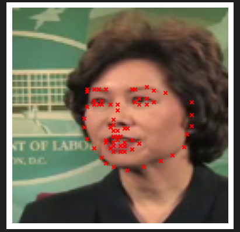
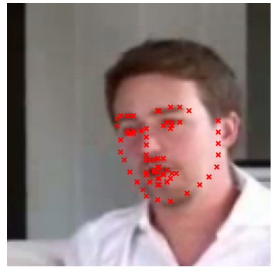

# CNN with SIFT Features for Keypoint Detection
This project implements a computer vision model that uses SIFT (Scale-Invariant Feature Transform) features combined with a convolutional neural network (CNN) for keypoint detection in images.

## Table of Contents

* [Introduction](#introduction)
* [Requirements](#requirements)
* [Features](#features)
* [Usage](#usage)
* [Data Generator](#data-generator)
* [Model Architecture](#model-architecture)
* [Results](#results)
* [Future Work](#future-work)
* [License](#license)

## Introduction
The primary goal of this project is to build a model that predicts keypoints in images using both image data and SIFT features. The model is designed to enhance keypoint detection accuracy by leveraging the spatial features extracted from images together with SIFT descriptors.

## Requirements
Make sure you have the following libraries installed:
    ```bash
    pip install numpy pandas opencv-python tensorflow matplotlib

The project was built using Jupyter Notebook and the following Python libraries:
- `numpy`
- `pandas`
- `cv2` (OpenCV)


## Dataset Structure
Ensure your dataset is organized as follows:

- **Training images folder**: .\training
- **Test images folder**: .\test
- **CSV files**:
  - training_frames_keypoints.csv: Contains training image names and corresponding keypoints.
  - test_frames_keypoints.csv: Contains test image names and corresponding keypoints.


## Features
- **Data Preprocessing**: Custom DataGeneratorWithSIFT class for loading and preprocessing images along with SIFT descriptors.
- **Convolutional Neural Network**: A CNN model architecture that combines image and SIFT features for keypoint detection.
- **Model Training**: Train the model on the dataset with adjustable epochs and validate its performance.
- **Visualization**: Function to visualize the detected keypoints on images.

## Usage
- **Prepare Your Data**: Place your training images in a folder named training and your test images in a folder named test. Ensure the corresponding **CSV files (training_frames_keypoints.csv and test_frames_keypoints.csv)** are located in the same directory.
- **Run the Jupyter Notebook**: Open the provided Jupyter Notebook and run the cells sequentially. This will load the data, train the model, and generate predictions.
- **Visualize Keypoints**: To visualize detected keypoints on images, utilize the check_keypoints_in_data function which displays images with the keypoints overlaid.

## Data Generator
The DataGeneratorWithSIFT class is responsible for loading images and their corresponding keypoints. It utilizes OpenCV’s SIFT detector to extract descriptors from the images, handling resizing and normalization:
    ````bash
        class DataGeneratorWithSIFT(Sequence):
            ...

## Parameters
- **Batch Size**: Controls the number of samples processed before the model updates weights.
- **Image Size**: Final dimensions each input image will be resized to.

## Model Architecture
The hybrid model consists of:
- A CNN to extract high-level image features.
- Dense layers to process SIFT features.
- A fully connected layer combining CNN and SIFT features to predict keypoints.

The model combines a CNN with a SIFT descriptor input to predict keypoints:
    ````bash
       def create_model():
            image_input = Input(shape=(IMG_WIDTH, IMG_HEIGHT, 3))
            ... 


## Layers
- **Convolutional Layers**: For feature extraction from images.
- **Dense Layers**: To process SIFT features and combine with image features.

## Results
The model is trained over 10 epochs, and predictions can be visualized against the true keypoints in the images using the check_keypoints_in_data function, which displays images with detected keypoints.

### Some Results Images:



## Future Work
- Experiment with different optimizers and learning rates to improve convergence.
- Integrate additional feature extraction techniques to enhance keypoint detection accuracy.
- Explore transfer learning with pre-trained models for robust feature extraction.

## License
This project is licensed under the MIT License. See the LICENSE file for details.